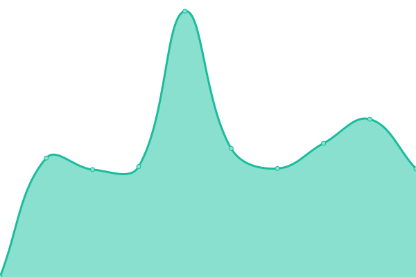

# [📈 Live Status](https://demo.upptime.js.org): <!--live status--> **🟩 All systems operational**

This repository contains the open-source uptime monitor and status page for [Upptime](https://upptime.js.org), powered by [Upptime](https://github.com/upptime/upptime).

With [Upptime](https://upptime.js.org), you can get your own unlimited and free uptime monitor and status page, powered entirely by a GitHub repository. We use [Issues](https://github.com/upptime/upptime/issues) as incident reports, [Actions](https://github.com/berhei/monitor/actions) as uptime monitors, and [Pages](https://demo.upptime.js.org) for the status page.

<!--start: status pages-->
<!-- This summary is generated by Upptime (https://github.com/upptime/upptime) -->
<!-- Do not edit this manually, your changes will be overwritten -->
<!-- prettier-ignore -->
| URL | Status | History | Response Time | Uptime |
| --- | ------ | ------- | ------------- | ------ |
|  [Google](https://www.google.com) | 🟩 Up | [google.yml](https://github.com/berhei/monitor/commits/HEAD/history/google.yml) | 

 119ms
     
 | 

<a href="https://berhei.github.io/monitor/history/google">100.00%</a>
    

|  [Test Shop](https://shop.krones.com) | 🟩 Up | [test-shop.yml](https://github.com/berhei/monitor/commits/HEAD/history/test-shop.yml) | 

 1491ms
     
 | 

<a href="https://berhei.github.io/monitor/history/test-shop">100.00%</a>
    

|  [Test Company](https://krones.com) | 🟩 Up | [test-company.yml](https://github.com/berhei/monitor/commits/HEAD/history/test-company.yml) | 

 2146ms
     
 | 

<a href="https://berhei.github.io/monitor/history/test-company">100.00%</a>
    

|  [Test static](https://nogood.name) | 🟩 Up | [test-static.yml](https://github.com/berhei/monitor/commits/HEAD/history/test-static.yml) | 

 624ms
     
 | 

<a href="https://berhei.github.io/monitor/history/test-static">100.00%</a>
    

|  [Test nc](https://nc.nogood.name) | 🟩 Up | [test-nc.yml](https://github.com/berhei/monitor/commits/HEAD/history/test-nc.yml) | 

 1144ms
     
 | 

<a href="https://berhei.github.io/monitor/history/test-nc">100.00%</a>
    

<!--end: status pages-->

[**Visit our status website →**](https://berhei.github.io/monitor/)

## 📄 License

- Powered by: [Upptime](https://github.com/upptime/upptime)
- Code: [MIT](./LICENSE) © [Upptime](https://upptime.js.org)
- Data in the `./history` directory: [Open Database License](https://opendatacommons.org/licenses/odbl/1-0/)
